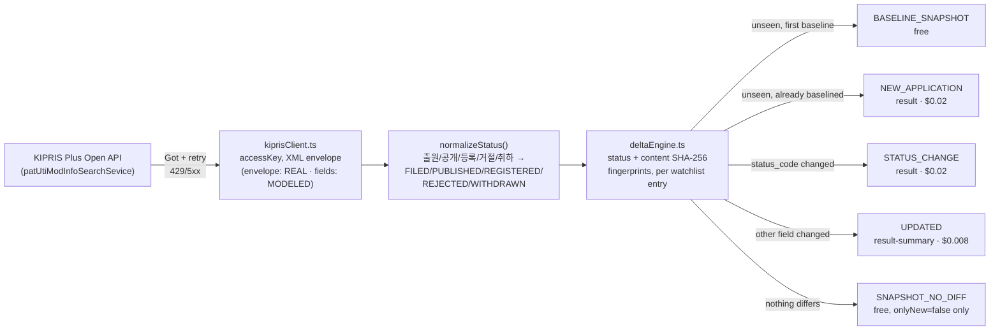

<div align="center">

# KIPRIS Patent & Trademark Status-Change Monitor

**Bring-your-own-key delta monitoring for Korean patent and utility-model filings on KIPRIS Plus — get an event the moment a tracked application's status changes, never a KIPRIS Plus license markup. Pay-per-event, $0.00 on unchanged runs.**

[](https://apify.com/stefano_seggio/kipris-patent-trademark-status-monitor)
[](#pricing-pay-per-event)
[](https://www.typescriptlang.org/)
[](#license)
[](#architecture)

</div>

## What this is

Polls Korea's official KIPRIS Plus Open API (Korea Intellectual Property Rights Information Service, operated by KIPO/KIPI) against a caller-supplied watchlist of applicant names or exact application numbers, and emits an event only when a tracked filing is new or its status actually changes. It extends this operator's existing USPTO/EPO patent-dispute monitor into a jurisdiction neither of those two sources touches — instead of someone on a docketing or IP-ops team re-running KIPRIS searches by hand, or writing and babysitting a cron script against an unfamiliar Korean-government XML API, this runs on a schedule and only ever surfaces what changed.

## An important, upfront disclosure about this build's verification

KIPRIS Plus is **not** a free-developer-registration API like USPTO ODP or EPO OPS. It is a paid product license — a flat annual service fee, independently confirmed live against the official KIPRIS Plus fee page during this build: *"Open API: A flat-rate annual service fee is $1,783 (searching for up to 1,000 cases a month for free)"* — or a roughly $445/yr discounted rate not confirmed eligible for any particular account. This build does not hold a paid, registered KIPRIS Plus service key, and creating a paid government-service account is outside what it is authorized to do on its own.

What this means concretely:

- The real base endpoint (`http://plus.kipris.or.kr/openapi/rest/patUtiModInfoSearchSevice/...`) and its XML error envelope were **independently confirmed live** — an unauthenticated request genuinely returns `HTTP 200` with `<response><header><resultCode>30</resultCode><resultMsg>SERVICE_KEY_IS_NOT_REGISTERED_ERROR</resultMsg></header></response>`. This Actor's transport, retry, and error-classification logic is built and tested against that real, live-observed behavior.
- The exact field names inside a **successful** response (`applicationNumber`, `inventionTitle`, `applicantName`, `registerStatus`, etc.) could **not** be independently verified against a real successful call. They are modeled on a real, independently-published third-party reference implementation (the npm package `kipris-mcp-server`, inspected during this build) that wraps the same confirmed endpoint — itself an unofficial community source, not KIPRIS's own specification.
- The live end-to-end smoke test performed for this Actor proves the transport layer, the real XML envelope parsing, and its graceful-error-handling path against the genuine live server — not the full success-path data mapping, which remains unverified pending a real paid key.

This is disclosed here deliberately: never claim "zero-defect" or "live-verified" for something that wasn't actually run against real success-case data.

## Architecture



Cold start is per-watchlist-entry, not a single global flag: adding a new applicant to an already-running watchlist gets its own free baseline run, independent of whatever state the rest of the watchlist is already in.

## Features

| Capability | Detail |
|---|---|
| Applicant-name watchlist | Track Korean or English applicant/company names (e.g. `한빛전자 주식회사`) against KIPRIS Plus's applicant-name search field. |
| Exact application-number watchlist | Track individual filings directly by KIPO-format application number (e.g. `1020220114820`) instead of an applicant's whole portfolio. |
| Patent / utility-model toggles | `includePatents` and `includeUtilityModels` independently include or exclude each filing type from the watchlist walk. |
| Delta mode (`onlyNew`) | Off by default so you can validate output for free against `BASELINE_SNAPSHOT`/`SNAPSHOT_NO_DIFF` records; on, it persists seen-record state and only charges for what actually changed. |
| Per-entry item cap | `maxItemsPerWatchlistEntry` bounds how many records KIPRIS Plus can return for any single watchlist entry in one run. |
| Named, resettable delta state | `deltaStateName` isolates multiple watchlists' baselines from each other; `resetState` clears one and re-baselines it from scratch. |
| Normalized status vocabulary | Raw KIPRIS status text is keyword-matched into a stable `FILED / PUBLISHED / REGISTERED / REJECTED / WITHDRAWN / UNKNOWN` enum. |
| Configurable transport resilience | `requestDelayMs`, `maxRetries`, and `requestTimeoutSecs` tune the pacing and retry behavior of every KIPRIS Plus request independently. |

## Quick start

1. Get an Apify API token from [console.apify.com/settings/integrations](https://console.apify.com/settings/integrations).
2. Have your own KIPRIS Plus service key ready — register directly with KIPRIS (see [Pricing](#pricing-pay-per-event) below for why this Actor requires it).
3. Run it with the input schema below, leaving `onlyNew` at its default `false` for the first run — every matched record comes back as a free `BASELINE_SNAPSHOT`/`SNAPSHOT_NO_DIFF`, so you can confirm the watchlist matches what you expect before switching it on.

```json
{
  "watchlistApplicants": ["Samsung Electronics"],
  "includePatents": true,
  "includeUtilityModels": false,
  "onlyNew": false,
  "byoKiprisServiceKey": "<your KIPRIS Plus service key>"
}
```

### cURL — instant terminal run

Runs synchronously and returns the resulting dataset items directly in the response, no polling needed:

```bash
curl -X POST "https://api.apify.com/v2/acts/9Wg73rplxFqgVq6fY/run-sync-get-dataset-items?token=<YOUR_API_TOKEN>" \
  -H "Content-Type: application/json" \
  -d '{
  "watchlistApplicants": ["Samsung Electronics"],
  "includePatents": true,
  "includeUtilityModels": false,
  "byoKiprisServiceKey": "<your KIPRIS Plus service key>"
}'
```

### Python — `apify-client` SDK

```python
from apify_client import ApifyClient

client = ApifyClient("<YOUR_API_TOKEN>")

run_input = {
    "watchlistApplicants": ["Samsung Electronics"],
    "includePatents": True,
    "includeUtilityModels": False,
    "byoKiprisServiceKey": "<your KIPRIS Plus service key>",
}

run = client.actor("9Wg73rplxFqgVq6fY").call(run_input=run_input)

for item in client.dataset(run["defaultDatasetId"]).iterate_items():
    print(item)
```

### Apify CLI

```bash
apify call kipris-patent-trademark-status-monitor \
  --input '{
    "watchlistApplicants": ["Hanbit Electronics Co., Ltd."],
    "watchlistApplicationNumbers": ["1020220114820"],
    "includePatents": true,
    "includeUtilityModels": true,
    "onlyNew": false,
    "byoKiprisServiceKey": "YOUR_KIPRIS_PLUS_SERVICE_KEY"
  }'
```

## Sample output record

One real record shape from this Actor's dataset, matching `.actor/dataset_schema.json`:

```json
{
  "record_id": "1020260045123",
  "event_id": "f0b3d8f2a1c9d3e6b47058a1c4e9f2b5d8a1c4e7",
  "event_type": "STATUS_CHANGE",
  "scraped_at": "2026-09-15T14:25:00.000Z",
  "is_new": false,
  "source_url": "http://plus.kipris.or.kr/openapi/rest/patUtiModInfoSearchSevice/applicationNumberSearchInfo",
  "application_number": "1020260045123",
  "invention_title": "Method and apparatus for adaptive display refresh rate control",
  "applicant_name": "Samsung Electronics Co., Ltd.",
  "ip_type": "patent",
  "status_code": "REGISTERED"
}
```

`event_type` tells you immediately whether this is a fresh baseline, a new filing, a status change, or a non-status update — see [Architecture](#architecture) for exactly which of those triggers billing.

## Pricing (Pay-Per-Event)

This Actor is **pure bring-your-own-key**: you hold and pay for your own KIPRIS Plus subscription directly — KIPRIS bills you, not this Actor. The events below cover only the delta-monitoring service itself, not a markup on KIPRIS Plus's own license.

| Event | Price | Charged when |
|---|---|---|
| `NEW_APPLICATION` / `STATUS_CHANGE` (`result`) | **$0.02** | A tracked filing is new (post-baseline), or its normalized status changes. |
| `UPDATED` (`result-summary`) | **$0.008** | A non-status field changes (title, applicant name) with status unchanged. |
| `BASELINE_SNAPSHOT` / `SNAPSHOT_NO_DIFF` | Free | Only delivered when `onlyNew: false`; never charged. |
| Actor start | $0.00005 | One-time per run (per GB-memory), not per record. |

This Actor carries no KIPRIS Plus licensing cost of its own — `byoKiprisServiceKey` is required input precisely so that every customer's own KIPRIS Plus subscription (its real $1,783/yr fee, or the unconfirmed ~$445/yr discounted rate) is billed directly between that customer and KIPRIS, never passed through this Actor. With no license cost to recoup, pricing here is set to match this fleet's other delta-monitor rates, not scaled to a six-figure break-even volume the way an operator-absorbed-license model would require.

Billing implementation detail: `Actor.pushData(record, eventName)` performs the charge directly; `Actor.charge()` is never called in addition.

## Why not just scrape it yourself

- **Zero infrastructure** — no server, cron box, or container to keep patched and running just to poll a government API on a schedule.
- **Managed scheduling** — Apify's built-in scheduler runs the watchlist walk on your cadence; you don't write or monitor the cron job.
- **No transport babysitting** — retry/backoff for 429s and 5xxs, per-request timeouts, and KIPRIS's own XML error envelope (including the real, live-confirmed `SERVICE_KEY_IS_NOT_REGISTERED_ERROR` response) are already handled.
- **Built-in delta detection across runs** — the SHA-256 status/content fingerprint pair and per-watchlist-entry baseline state mean cross-run change detection is the default, not something you'd design and persist yourself.

## FAQ

**Is there a KIPRIS Plus API quota or rate limit I should know about?**
KIPRIS Plus's real per-key rate ceiling has not been independently confirmed by KIPRIS's own documentation. Rather than guess at an unverified number, this Actor defaults to a conservative, fixed `requestDelayMs` between requests — the same policy this operator's other actors use whenever a source's real rate limit isn't confirmable. `requestDelayMs`, `maxRetries`, and `requestTimeoutSecs` are all adjustable if your own key's real ceiling turns out to be higher.

**Are the output field names guaranteed to match a real KIPRIS Plus response?**
No — see the verification disclosure above. They're modeled on an independently-published third-party reference (`kipris-mcp-server`), not confirmed against a real successful KIPRIS Plus call, because this build doesn't hold a paid, registered service key. If they differ once you run this against a real key, `toSnapshot()` in `main.ts` and the `RawKiprisItem` shape in `types.ts` are the two places to correct.

**Do unchanged runs really cost $0.00?**
Yes. `BASELINE_SNAPSHOT` and `SNAPSHOT_NO_DIFF` events are never billed, regardless of watchlist size — you only pay for `NEW_APPLICATION`, `STATUS_CHANGE`, or `UPDATED` events, which only fire when something in KIPRIS Plus's own data actually moved.

**What happens if KIPRIS Plus itself is down or returns an error?**
The transport layer retries 429/5xx responses with backoff (`maxRetries`, configurable) and distinguishes a network/upstream failure from this Actor's own logic errors in its run log, rather than surfacing one generic failure for both.

## Known limitations, disclosed rather than hidden

- The exact KIPRIS Plus success-response field names are modeled, not independently verified — see the disclosure above.
- This Actor requires your own paid KIPRIS Plus service key, by design, not as a stopgap. There is deliberately no operator-held shared key.
- Applicant-name matching is inherently fuzzy for Korean legal-entity names (romanization/translation variants) — prefer exact application numbers wherever precision matters.
- KIPRIS Plus refreshes on its own agency cadence, not in real time — this Actor cannot report a change faster than KIPRIS itself republishes it.
- Demand for this category is genuinely unproven — the one comparable Apify Store actor found in research for this build sits at 1 total user, 0 monthly actives, no reviews.
- Not a substitute for a patent or trademark attorney's own docketing system or legal judgment.

## Support & Enterprise SLA

Independently developed and maintained by Stefano Seggio — not a managed enterprise product, and there is no contractual uptime SLA. Issues and feature requests: open an issue against this Actor's Store listing. Typical triage time: within 48 hours.

## License

The wrapper code, documentation, and integration examples in the [GitHub repository](https://github.com/stefanoseggio/kipris-patent-trademark-status-monitor) are MIT licensed. This repository does not contain the Actor's proprietary monitoring logic, which runs privately on Apify's platform.

---

### About Delta Registry

This Actor is part of **Delta Registry** — pay-per-event regulatory & compliance data infrastructure spanning patent, trademark, and enforcement monitoring across multiple jurisdictions. For professional inquiries or enterprise licensing, reach out on [LinkedIn](https://www.linkedin.com/in/stefanoseggio-deltaregistry). For the rest of the fleet, see [github.com/stefanoseggio](https://github.com/stefanoseggio).
