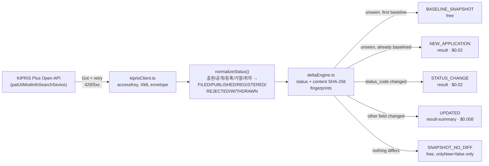

<div align="center">

# KIPRIS Patent & Trademark Status-Change Monitor

**Bring-your-own-key delta monitoring for Korean patent and utility-model filings on KIPRIS Plus — get an event the moment a tracked application's status changes, never a KIPRIS Plus license markup.**

[](https://apify.com)
[](#pricing-pay-per-event)
[](https://www.typescriptlang.org/)
[](#license)

[](https://console.apify.com/actors/9Wg73rplxFqgVq6fY)

</div>

The Console link above is live today but private while this Actor finishes its Store review. Once published it will also be runnable from the public Store listing at [apify.com/stefano_seggio/kipris-patent-trademark-status-monitor](https://apify.com/stefano_seggio/kipris-patent-trademark-status-monitor).

## What this is

If you've searched for a **KIPRIS Plus API wrapper**, a **KIPRIS Open API SDK alternative**, or a way to bolt **Korean patent office IP monitoring** onto a docketing pipeline without hand-rolling XML parsing and retry logic, this is that wrapper — packaged as a scheduled, hosted Apify Actor instead of a library you maintain yourself. It polls KIPRIS Plus (Korea Intellectual Property Rights Information Service, the official patent/trademark data API operated by KIPO/KIPI) against a watchlist of applicant names or exact application numbers, and emits a structured event only when a tracked filing is new or its status actually changes.

The design decision that shapes everything else here is **deliberately bring-your-own-key (BYOK)**: KIPRIS Plus is a paid product license (a flat annual service fee independently confirmed against KIPRIS's own fee page, not free developer registration like USPTO ODP or EPO OPS), and this Actor never holds a shared operator key. You register your own KIPRIS Plus subscription and KIPRIS bills you directly for API usage — this Actor charges only for the delta-monitoring layer on top, which is what keeps its own per-event price a fraction of what an operator-absorbed-license model would need to charge to break even.

The pain point it removes is manual polling: instead of someone on a docketing or IP-ops team re-running KIPRIS searches by hand (or writing and babysitting a cron script against an unfamiliar Korean-government XML API) to catch a status flip from filed to published to registered, this Actor runs on a schedule, keeps its own per-watchlist-entry baseline, and only surfaces what changed.

## Architecture



Cold start is per-watchlist-entry, not a single global flag: adding a new applicant to an already-running watchlist gets its own free baseline run, independent of whatever state the rest of the watchlist is already in.

## Features

| Capability | Detail |
|---|---|
| Applicant-name watchlist | Track Korean or English applicant/company names (e.g. `한빛전자 주식회사`) against KIPRIS Plus's applicant-name search field. |
| Exact application-number watchlist | Track individual filings directly by KIPO-format application number (e.g. `1020220114820`) instead of an applicant's whole portfolio. |
| Patent / utility-model toggles | `includePatents` and `includeUtilityModels` independently include or exclude each filing type from the watchlist walk. |
| Delta mode (`onlyNew`) | Off by default so you can validate output for free against `BASELINE_SNAPSHOT`/`SNAPSHOT_NO_DIFF` records; on, it persists seen-record state and only charges for what actually changed. |
| Per-entry item cap | `maxItemsPerWatchlistEntry` bounds how many records KIPRIS Plus can return for any single watchlist entry in one run. |
| Named, resettable delta state | `deltaStateName` isolates multiple watchlists' baselines from each other; `resetState` clears one and re-baselines it from scratch. |
| Normalized status vocabulary | Raw KIPRIS status text is keyword-matched into a stable `FILED / PUBLISHED / REGISTERED / REJECTED / WITHDRAWN / UNKNOWN` enum so downstream logic never parses Korean prosecution terms itself. |
| Configurable transport resilience | `requestDelayMs`, `maxRetries`, and `requestTimeoutSecs` tune the pacing and retry behavior of every KIPRIS Plus request independently. |

## Quick start

1. Get an Apify API token from the [Integrations tab of your Apify account settings](https://console.apify.com/account/integrations).
2. Have your own KIPRIS Plus service key ready (register directly with KIPRIS — see [Pricing](#pricing-pay-per-event) below for why this Actor requires it).
3. Call the Actor with the [Apify CLI](https://docs.apify.com/cli):

```bash
apify call kipris-patent-trademark-status-monitor \
  --input '{
    "watchlistApplicants": ["Hanbit Electronics Co., Ltd."],
    "watchlistApplicationNumbers": ["1020220114820"],
    "includePatents": true,
    "includeUtilityModels": true,
    "onlyNew": false,
    "byoKiprisServiceKey": "YOUR_KIPRIS_PLUS_SERVICE_KEY"
  }'
```

Leave `onlyNew` at its default `false` for the first run — every matched record comes back as a free `BASELINE_SNAPSHOT`/`SNAPSHOT_NO_DIFF`, so you can confirm the watchlist matches what you expect before switching it on and starting to pay for `NEW_APPLICATION` / `STATUS_CHANGE` / `UPDATED` events.

## Pricing (Pay-Per-Event)

This Actor is **pure bring-your-own-key**: you hold and pay for your own KIPRIS Plus subscription directly — KIPRIS bills you, not this Actor. The events below cover only the delta-monitoring service itself, not a markup on KIPRIS Plus's own license.

| Event | Price | Charged when |
|---|---|---|
| `NEW_APPLICATION` / `STATUS_CHANGE` (`result`) | **$0.02** | A tracked filing is new (post-baseline), or its normalized status changes. |
| `UPDATED` (`result-summary`) | **$0.008** | A non-status field (title, applicant name) changes with status unchanged. |
| `BASELINE_SNAPSHOT` / `SNAPSHOT_NO_DIFF` | **Free** | Only delivered when `onlyNew: false`; never charged. |

Monetization transparency: the first-seen baseline and no-change confirmations are always free, no matter how large your watchlist is — you only pay when something in KIPRIS Plus's own data actually moved.

## Why not just scrape it yourself

- **Zero infrastructure** — no server, cron box, or container to keep patched and running just to poll a government API on a schedule.
- **Managed scheduling** — Apify's built-in scheduler runs the watchlist walk on your cadence; you don't write or monitor the cron job.
- **No transport babysitting** — retry/backoff for 429s and 5xxs, per-request timeouts, and KIPRIS's own XML error envelope (including the real, live-confirmed `SERVICE_KEY_IS_NOT_REGISTERED_ERROR` response) are already handled.
- **Built-in delta detection across runs** — the SHA-256 status/content fingerprint pair and per-watchlist-entry baseline state mean cross-run change detection is the default behavior, not something you'd have to design and persist yourself.

## Known limitations

Disclosed directly from this Actor's own documentation, not smoothed over: applicant-name matching is inherently fuzzy for Korean legal-entity names with romanization/translation variants (prefer exact application numbers where precision matters); KIPRIS Plus refreshes on its own agency cadence, so this Actor cannot report a change faster than KIPRIS itself republishes it; and this is not a substitute for a patent or trademark attorney's own docketing system or legal judgment.

## Code snippets

Minimal Node.js and Python examples calling this Actor via `apify-client` are included in this repository under [`examples/`](examples).

## License

The wrapper code, documentation, and integration examples in this repository are MIT licensed. This repository does not contain the Actor's proprietary monitoring logic, which runs privately on Apify's platform.

---

### About Delta Registry

This Actor is part of **Delta Registry** — pay-per-event regulatory & compliance data infrastructure spanning patent, trademark, and enforcement monitoring across multiple jurisdictions. For professional inquiries or enterprise licensing, reach out on [LinkedIn](https://www.linkedin.com/in/stefanoseggio-deltaregistry). For the rest of the fleet, see [github.com/stefanoseggio](https://github.com/stefanoseggio).
